<p align="center">
  
</p>

A fork of [Sketchy Cheat Menu](https://steamcommunity.com/sharedfiles/filedetails/?id=608738995) by [Sketchy](https://steamcommunity.com/id/sketchy77) — please go rate and favorite his mod.

<p align="center">
  <a href="docs/enable-cheats.jpg">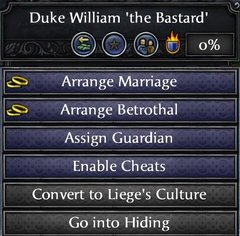</a>
  <a href="docs/cheat-decisions.jpg">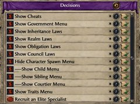</a>
  <a href="docs/cheat-decisions-cheats.jpg">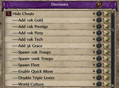</a>
</p>
<p align="center">
  <a href="docs/cheat-decisions-government-realm.jpg">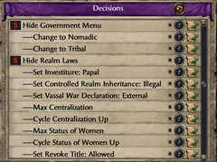</a>
  <a href="docs/cheat-decisions-obligation.jpg">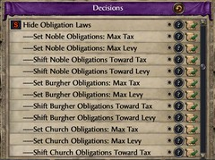</a>
  <a href="docs/cheat-decisions-council.jpg">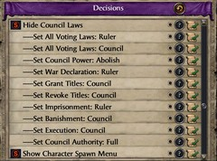</a>
</p>
<p align="center">
  <a href="docs/title-menu.jpg">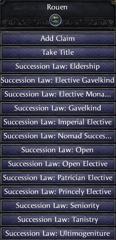</a>
  <a href="docs/title-menu-2.jpg">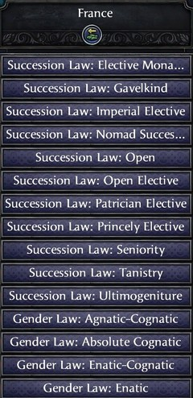</a>
  <a href="docs/cheat-decisions-spawn.jpg">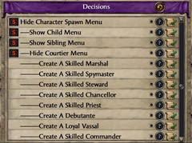</a>
</p>
<p align="center">
  <a href="docs/cheat-decisions-traits.jpg">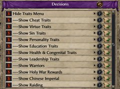</a>
  <a href="docs/cheat-decisions-traits-2.jpg">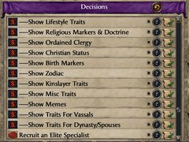</a>
  <a href="docs/cheat-decisions-bulk.jpg">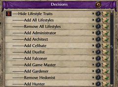</a>
</p>
<p align="center">
  <a href="docs/cheat-decisions-court.jpg">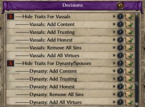</a>
  <a href="docs/build-menu.jpg">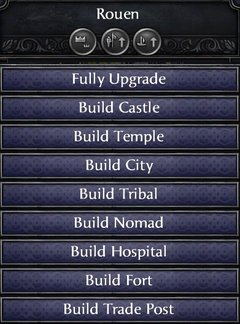</a>
  <a href="docs/trait-icons.jpg">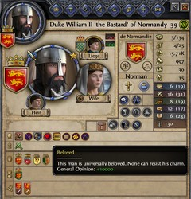</a>
</p>

<p align="center"><sub><em>Screenshots taken with the <a href="https://steamcommunity.com/sharedfiles/filedetails/?id=3054987840">Proper 4K UI Project</a> mod enabled.</em></sub></p>

## What it does

Sketchy Cheat Menu Plus adds a comprehensive in-game cheat menu. Right-click your own portrait and pick **Enable Cheats** to turn it on; **Disable Cheats** when done. AI characters never see these decisions.

### Right-click your character

- **Enable / Disable Cheats** — master toggle for the cheat menu.
- **Enable / Disable Mind Control** — master toggle for possessing other characters.
- **Increase / Decrease Stats** — modify your five attributes.
- **Heal Them** — remove all illnesses, diseases, and wounds.
- **Improve Genes** — strip negative congenital traits, add all positive.
- **Clear Focus / Ambition** — cancel your current focus or ambition.
- **Remove Nickname** — clear your current nickname.
- **Fall On Your Sword** — kill yourself.

### Right-click another character

Everything in the section above also works on other characters — plus:

- **Mind control**
  1. **Enable Mind Control** on your own portrait.
  2. **Control Mind** on any character to possess them.
  3. `Mind Control:` decisions then appear on any character — force the possessed target to imprison, marry, impregnate, vassalize, become their lover / friend / rival, or abdicate.
- **Dynasty and marriage** — **Adopt Them**, **Disown Them**, **Join Their Dynasty**, **Exterminate Dynasty**, **Marry Them**, **End Marriage**, **Take As Concubine**, **Impregnate Them**.
- **Elimination** — **Kill Them**, **Imprison Them**.
- **Subjugation** — **Abdicate To Me**, **Vassalize Them**, **Move Them** into your court.
- **Relationships** — **Make / Remove Friend**, **Make / Remove Rival**, **Make Lover**, **Make Them Loyal**, **Get A Favor**, **Back My Plot**.
- **Conversion** — **Convert To My Religion / Culture / Ethnicity**.
- **Immortality** — **Make Immortal**, **Remove Immortality**.

### Right-click a settlement

#### Any settlement
- **Fully Upgrade** — adds every applicable building.
- **Convert To Castle / Temple / City / Tribal / Nomad** — hidden on any realm's capital.
- **Destroy Holding** — hidden on any county capital.

#### County capital only
- **Build Castle / Temple / City / Tribal / Nomad** — new holding in an empty slot.
- **Build Hospital** — The Reaper's Due.
- **Build Fort**.
- **Build Trade Post** — The Republic.
- **Fully Upgrade Hospital** — The Reaper's Due.

#### Trade post
- **Fully Upgrade** — adds every trade-post building.

### Right-click a title

- **Add Claim** — hidden on titles you already hold.
- **Take Title** — hidden on titles you already hold.
- **Succession Law: Eldership / Elective Gavelkind / Elective Monarchy / Elective Republic (Open Elective) / Gavelkind / Imperial Elective / Nomad Succession / Open / Patrician Elective / Primogeniture / Princely Elective / Seniority / Tanistry / Ultimogeniture** — Eldership requires Holy Fury, Nomad Succession requires Horse Lords, Patrician Elective requires The Republic.
- **Gender Law: Agnatic / Agnatic-Cognatic / Absolute Cognatic / Enatic-Cognatic / Enatic** — on Iqta, Holy Order, and Merchant Republic sources, these carry "(Hidden)" suffix — the engine applies the law but the Inheritance UI doesn't show gender on those governments.

### Intrigue menu decisions

Accessed via the Decisions panel (Intrigue tab) once cheats are enabled. Each sub-section is shown or hidden by its own toggle.

#### Cheats

- **Add 10k Gold / Prestige / Piety / Tech**
- **Add 5k Grace** — Jade Dragon.
- **Add 5k Society Points / Increase Society Rank** — Monks and Mystics.
- **Spawn 10k / 100k Troops**
- **Spawn Fleet** — 1k galleys.
- **Convert Realm To Your Culture / Religion / Ethnicity**
- **World Culture / Religion / Ethnicity** — convert every province on the map to yours.
- **Enable / Disable Quick Move** — toggle near-instant army movement.
- **Enable / Disable Triple Levies**
- **Reveal Realm Plots**
- **Raise Religious Authority** — maxes your religion's moral authority.
- **Lower Threat Level** — resets threat to zero.
- **Revoke all Vassal Titles**
- **Kill All Courtiers** — kills every non-family courtier.
- **Cheat Trait Cleaner** — strips the 5 SCMP-custom cheat traits and Immortal from any non-player character.

#### Government

- **Become Independent** — from any vassal state.
- **Change to Feudalism** — from Tribal (non-Muslim) or Nomadic (Destroy Horde) sources.
- **Change to Iqta** — from Tribal (Muslim) or Nomadic (Destroy Horde) sources.
- **Change to Tribal** — from Feudal / Iqta / Monastic Feudal / Chinese Imperial / Nomadic (Destroy Horde) sources.
- **Change to Nomadic** — from Feudal / Tribal / Iqta / Monastic Feudal / Order / Chinese Imperial sources. Horse Lords.

#### Realm Laws

Applies to your primary title.

- **Crown Authority** — Cycle Up, Cycle Down, Max. Without Conclave only.
- **Centralization / Tribal Organization** — Cycle Up, Cycle Down, Max.
- **Status of Women** — Cycle Up, Cycle Down, Max. Conclave.
- **Investiture** — Free, Papal.
- **Controlled Realm Inheritance** — Free, Illegal. Conclave.
- **Vassal War Declaration** — Allowed, External, Illegal. Conclave.
- **Viceroyalty** — None, Kingdoms, Duchies. Charlemagne.
- **Revoke Title** — None, Allowed, Religious. Conclave.
- **Administration** — Feudal, Late, Imperial.

#### Obligation Laws

Applies to your primary title.

- **Noble / Iqta / Burgher / Church / Tribal Obligations** — Shift Toward Tax, Shift Toward Levy, Max Tax, Max Levy. Conclave.
- **Feudal / Iqta / City / Church / Tribal Obligations** — Shift Levies Higher / Lower, Shift Tax Higher / Lower per family, Set All Max / Min Levies / Tax. Without Conclave.

#### Council Laws

Applies to your primary title. Requires Conclave.

- **Council Power** — Abolish, Empower.
- **War Declaration** — Ruler, Council.
- **Grant Titles** — Ruler, Council.
- **Revoke Titles** — Ruler, Council.
- **Imprisonment** — Ruler, Council.
- **Banishment** — Ruler, Council.
- **Execution** — Ruler, Council.
- **Council Authority** — Limited, Full.
- **Set All Voting Laws** — Ruler, Council.

#### Character Spawn

- **Children** — Daughter / Son at ages 0, 6, 16.
- **Siblings** — Brother / Sister at ages 6, 16, 24, 30, 40.
- **Courtiers** — Marshal, Spymaster, Steward, Chancellor, Priest, Debutante (wife candidate), Vassal, Commander, Physician.

### Trait toggles

Paired add/remove decisions per trait, organized by category.

- **Cheat Traits** — Beloved, Immortal, Master Builder, Master Commander, Master Landowner, Master Plotter. `Add All` / `Remove All`.
- **Virtues** — Chaste, Temperate, Kind, Charitable, Patient, Diligent, Humble. `Add All` / `Remove All`.
- **Sins** — Lustful, Greedy, Slothful, Gluttonous, Wroth, Proud, Envious. `Add All` / `Remove All`.
- **Personality** — Positive: Ambitious, Brave, Brawny, Zealous, Erudite, Gregarious, Groomed, Honest, Just, Shrewd, Trusting. Negative: Content, Craven, Frail, Cynical, Shy, Uncouth, Deceitful, Arbitrary, Dull, Paranoid, Cruel, Stubborn. `Add All Positive` / `Remove All Positive` / `Add All Negative` / `Remove All Negative`.
- **Education** — Diplomacy, Martial, Stewardship, Intrigue, Learning.
- **Health & Congenital** — Fair, Genius, Quick, Strong, Giant, Lefthanded, Scarred, Scarred Mid, Scarred High, Freckles, Freckles 2, Freckles 3, Freckles 4, Freckles 5, Fat, Malnourished, Clubfooted, Dwarf, Harelip, Hunchback, Imbecile, Inbred, Lisp, Slow, Stutter, Ugly, Weak, Blinded, Depressed, Disfigured, Drunkard, Incapable, Infirm, Lover's Pox, Lunatic, Maimed, Mangled, One-Eyed, One-Handed, One-Legged, Possessed, Severely Injured, Sick Incapable, Stressed, Wounded. `Remove Defects` and `Remove Diseases` cover the 11 birth defects and disease cluster respectively.
- **Leadership** — Aggressive Leader, Battlefield Terrain Master, Defensive Leader, Direct Leader, Flanker, Holy Warrior, Inspiring Leader, Organizer, Siege Leader, Trickster, Unyielding Leader, Winter Soldier, Cavalry Leader, Heavy Infantry Leader, Light Foot Leader, War Elephant Leader, Desert Expert, Flat Terrain Expert, Jungle Expert, Mountain Expert, Rough Terrain Expert. `Add All` / `Remove All`.
- **Warriors** — Adventurer, Berserker, Gladiator, Shieldmaiden, Varangian. `Add All` / `Remove All`.
- **Holy War Rewards** — Ares' Own, Crusader, Crusader King, Crusader Queen, Eagle Knight, Sun Warrior, Gond-i Shahanshah, Hound of Dievas, Kailash Guardian, Kanai, Mujahid, Nyame's Shield, Perun's Chosen, Skylord, Ukko's Hammer, Valhalla Bound.
- **Warrior Lodge** — Aeneator, Fearsome, Forest Ambusher, Marauder, Mountain Guardian, Pillar of the Plains, Scorcher, Shield of the Tundra, Spirit Warrior.
- **Chinese Imperial** — Way of the Dog, Way of the Dragon, Way of the Leopard, Way of the Tiger, Kowtow Complete (Tier I), Kowtow Complete (Tier II), Kowtow Complete (Tier III). `Add All` / `Remove All`.
- **Raiding** — Viking, Pirate, Ravager, Sea King, Sea Queen.
- **Lifestyles** — Administrator, Architect, Celibate, Duelist, Falconer, Faqih, Game Master, Gardener, Hedonist, Hunter, Impaler, Master Schemer, Master Seducer, Master Seductress, Mystic, Poet, Renowned Physician, Scholar, Socializer, Strategist, Theologian. `Add All` / `Remove All`.
- **Religious Markers & Doctrine** — Hajjaj, Indian Pilgrim, Pilgrim, Reincarnation, Saoshyant, Saoshyant Descendant, Sympathy for Christian Religions, Sympathy for Eastern Religions, Sympathy for Israelite Religions, Sympathy for Mazdan Religions, Sympathy for Muslim Religions, Sympathy for Pagan Religions, Haemophiliac, Haemophant, Haemoarch, Syncretist, Spiritualist, Militant, Tribalist, Bad Priest (Aztec / Christian / Muslim / Norse / Tengri / Zoroastrian), Excommunicated. `Add All Sympathies` / `Remove All Sympathies`.
- **Ordained Clergy** — Monk, Nun, Bhikkhu, Bhikkhuni, Sanyasi, Sanyasini, Muni, Aryika.
- **Christian Status** — Crowned by Pope, Crowned by Bishop, Crowned by Priest, Crowned by Myself, Baptized by Pope, Baptized by Patriarch, Baptized by Bishop, Baptized by Satan, Beatified.
- **Muslim Status** — Ashari, Mutazilite, Decadent, Hafiz, Mirza, Sayyid.
- **Dharmic Identity** — Brahmin, Kshatriya, Vaishya, Shaivist, Shaktist, Smartist, Vaishnavist, Mahayana, Theravada, Vajrayana.
- **Birth Markers** — Bastard, Legit Bastard, Born in the Purple, Child of Concubine, Child of Consort, Twin.
- **Zodiac** — Aries, Taurus, Gemini, Cancer, Leo, Virgo, Libra, Scorpio, Sagittarius, Capricorn, Aquarius, Pisces.
- **Childhood** — Affectionate, Brooding, Conscientious, Curious, Fussy, Haughty, Idolizer, Indolent, Playful, Rowdy, Timid, Willful. `Add All` / `Remove All`.
- **Kinslayer** — Kinslayer, Familial Kinslayer, Dynastic Kinslayer, Tribal Kinslayer.
- **Misc Traits** — Augustus, Heresiarch, Peasant Leader, Cannibal, Eunuch, Homosexual.
- **Memes** — Cat, Horse.
- **Vassal Traits** — Content, Trusting, Honest. `Add All Virtues` / `Remove All Sins` applied across the player's vassals.
- **Dynasty & Spouse Traits** — Content, Trusting, Honest. `Add All Virtues` / `Remove All Sins` / `Add Good Congenital Traits` applied across the player's dynasty and spouses.

## Requirements

### Base game

- **Crusader Kings II `3.3.x`.** The base game is enough to install and use the mod.

### Optional DLC

The mod works without any DLC. Some cheats are tied to DLC systems and behave differently depending on what you have installed:

- **Charlemagne**
  - Hidden: the **Viceroyalty** realm law.
- **Conclave**
  - Hidden: the 8 Council Laws and the Controlled Realm Inheritance / Vassal War Declaration / Status of Women / Revoke Title realm laws.
  - The 5 Obligation Laws families switch to their vanilla 4-state form.
  - Administration collapses from (Feudal / Late / Imperial) to Feudal ↔ Imperial.
  - Crown Authority is hidden **with** Conclave (the Conclave-only realm laws replace it).
  - Stays: **Child of Concubine** and **Child of Consort** birth markers, the 12 Childhood trait toggles, and **Get A Favor**.
- **Holy Fury**
  - Hidden: bloodline buildings (Oppressive Fortifications / Special Fortifications / Monumental Shrines / Planned Infrastructure), Hellenic deity shrines, and Great Pillars — all require bloodlines or province flags earned via Holy Fury events.
  - Hidden if Monks and Mystics is also off: **Add 5k Society Points** and **Increase Society Rank** (both require society membership).
  - Stays: the **Kinslayer** / **Familial Kinslayer** / **Dynastic Kinslayer** / **Tribal Kinslayer** trait toggles, the **Grievously Scarred** / **Horrifically Scarred** trait toggles, the 9 **Warrior Lodge** traits, **Sea King** / **Sea Queen**, the 12 **Zodiac** traits, the **Syncretist** / **Spiritualist** / **Militant** / **Tribalist** pagan-branch traits, the **Haemophiliac** / **Haemophant** / **Haemoarch** bloodthirsty-gods traits, **Succession Law: Elective Monarchy**, and **Succession Law: Eldership**.
- **Horse Lords**
  - Hidden: **Change to Nomadic**, **Change to Feudalism (Destroy Horde)**, **Change to Iqta (Destroy Horde)**, **Change to Tribal (Destroy Horde)**, **Convert To Nomad**, and **Build Nomad**.
  - Stays: **Succession Law: Nomad Succession** and the **Horse** trait toggle.
- **Jade Dragon**
  - Hidden: **Add 5k Grace** and the 3 **Kowtow Complete** trait toggles (Tier I / II / III) (all involve the Grace resource, which needs Jade Dragon).
  - Stays: the 4 **Chinese Commander** trait toggles (Way of the Dog / Dragon / Leopard / Tiger).
- **Legacy of Rome**
  - Stays: **Succession Law: Imperial Elective** and the **Eunuch** / **Augustus** trait toggles.
- **Monks and Mystics**
  - Hidden if Holy Fury is also off: **Add 5k Society Points** and **Increase Society Rank** (both require society membership).
  - Stays: the **Mystic** trait toggle.
- **Rajas of India**
  - Hidden: the 6 **Dharmic Ordained Clergy** trait toggles, the 10 **Dharmic Identity** trait toggles, and **Indian Pilgrim** — all require a Dharmic religion (Hindu / Buddhist / Jain), which needs Rajas of India.
  - Stays: the **War Elephant Leader** trait toggle.
- **Sons of Abraham**
  - Hidden: the **Kanai** trait toggle (requires a Jewish religion; works with bookmark, but console errors).
- **Sunset Invasion**
  - Hidden: the **Eagle Knight** / **Sun Warrior** / **Bad Priest (Aztec)** trait toggles (all require Aztec religion, which needs Sunset Invasion or console).
- **Sword of Islam**
  - Hidden: **Change to Iqta**, the **Bad Priest (Muslim)**, **Faqih** lifestyle, **Muslim Status** (Ashari / Mutazilite / Mirza / Sayyid / Hafiz / Decadent) trait toggles (all require a Muslim religion, which needs Sword of Islam).
- **The Old Gods**
  - Stays: **Change to Tribal** and the **Viking** / **Pirate** / **Ravager** / **Sea King** / **Sea Queen** trait toggles. The government swap works without The Old Gods, but tribal-specific gameplay (retinues, prestige raiding, Adopt Feudalism path) still require the DLC.
- **The Reaper's Due**
  - Hidden: **Build Hospital** and **Fully Upgrade Hospital**.
  - Stays: the **Renowned Physician** trait toggle, **Create A Skilled Physician** courtier spawn, the 6 limb-loss trait toggles (**One-Eyed** / **One-Handed** / **One-Legged** / **Disfigured** / **Mangled** / **Severely Injured**), and the **Sick Incapable** trait toggle.
- **The Republic**
  - Hidden: the Merchant Republic Arsenal branch inside the city **Fully Upgrade** (requires an MR-owned capital; MRs aren't playable without The Republic).
  - Stays: **Succession Law: Patrician Elective**, **Build Trade Post**, and the trade post **Fully Upgrade** decision.
- **Way of Life**
  - Hidden: **Clear Your Focus**.
  - Stays: all 21 **Lifestyles** trait toggles.

## Installation

**Manual install:** drop `SketchyCheatMenuPlus/` and `SketchyCheatMenuPlus.mod` into:

```
Documents/Paradox Interactive/Crusader Kings II/mod/
```

…then enable **Sketchy Cheat Menu Plus** in the launcher.

**Proper4KUI users:** also install the **Sketchy Cheat Menu Plus - Proper4KUI Patch** companion sub-mod for hi-res versions of the decision icon and the 5 SCMP-custom cheat trait icons, sized to match Proper4KUI's larger UI. Vanilla players don't need it.

## Compatibility

Sketchy Cheat Menu Plus is a content mod that doesn't overwrite base-game files, so it should work alongside vanilla and most other mods as the original Sketchy Cheat Menu did.

### Sketchy Cheat Menu

Save-compatible with Sketchy Cheat Menu. All inherited data (custom traits, the dynasty-777777 "Outcast" formerly "Lowborn", event modifiers, custom buildings) keep their original IDs. Switching from Sketchy Cheat Menu just requires swapping the mod selection in the launcher.

### CleanSlate

Full support. This mod ships with `dependencies = { "CleanSlate" }` declared, so it works with CleanSlate enabled and on plain vanilla.

Trait IDs are auto-adapted. CleanSlate renames several traits and sets a `cleanslate_active` global flag at startup; when that flag is present, this mod's trait-toggle decisions use CleanSlate's trait names instead of vanilla's.

Aztec culture and building IDs are also auto-adapted. CleanSlate renames the Aztec culture and its cultural building IDs; the `convert_*` strip helpers and the `upgrade_castle` / `upgrade_tribal` culture-aware adds pick the matching ID set under each stack.

`Elective Republic` displays as `Open Elective` on CleanSlate.

The `triple_levies` cheat modifier icon matches on both vanilla and CleanSlate stacks.

**CleanSlate users — make sure you're on the latest version from [GitHub](https://github.com/ck2plus/CleanSlate)** — the startup flag is a recent addition. Without it, the mod uses vanilla IDs throughout, so trait-toggle and Aztec-building operations silently fail on a CleanSlate stack.

### CK2+ (CK2Plus)

Depends on CleanSlate, as does this mod. Historically OK with Sketchy Cheat Menu; not verified for this fork.

### AGOT (A Game of Thrones)

Historically incompatible with Sketchy Cheat Menu; not verified for this fork.

## For modders

### Detection

Two flags let other mods detect this mod and the characters it spawns:

- **Mod** — Sketchy Cheat Menu Plus sets the global flag `scmp_active` at `on_startup` (on new games and on every save load). Check for it with `has_global_flag = scmp_active` — the same way this mod detects CleanSlate's `cleanslate_active`.
- **Spawned Character** — Each character spawned via the menu's spawn decisions is tagged with a per-character flag — `scmp_spawned_child`, `scmp_spawned_sibling`, `scmp_spawned_wife`, `scmp_spawned_vassal`, `scmp_spawned_marshal`, `scmp_spawned_spymaster`, `scmp_spawned_steward`, `scmp_spawned_chancellor`, `scmp_spawned_priest`, `scmp_spawned_commander`, or `scmp_spawned_physician` — so you can match them with `has_character_flag`.

### error.log notes

CK2's static parser validates every trait ID in a trigger context — both `scripted_trigger` bodies and `limit = { ... }` blocks inside scripted_effects. The CleanSlate compat triggers deliberately reference both vanilla and CleanSlate trait IDs across branches so the runtime picks the right one — but the parser flags the inactive branch's IDs as "unknown trait" warnings (~67 on either stack). These are cosmetic; runtime gating on `has_global_flag = cleanslate_active` ensures only the active stack's IDs are evaluated.

### Dev/test events

Hard-to-reach paths (e.g., verifying the dynasty 777777 "Outcast" label, granting Holy Fury bloodlines for `upgrade_X` testing) have console-grant helpers in a sibling sub-mod, **Sketchy Cheat Menu Plus - Debug**. Enable it in the launcher alongside SCMP to use the `SCMPD.*` events — e.g. `event SCMPD.1 <charID>` assigns the target to dynasty 777777; `event SCMPD.2`–`SCMPD.5 <charID>` grant the 4 Holy Fury building-related bloodlines. The base mod doesn't ship these events.

## Development

The mod's script and localisation files (`.txt`, `.csv`) are stored in git as **Windows-1252** with CRLF line endings (enforced by `.gitattributes`) because CK2 reads them that way. Markdown files (this README, the changelog) are plain UTF-8.

For contributors:

- **Accented localisation edits must be saved as Windows-1252,** not UTF-8 — a UTF-8 save corrupts accents.
- A UTF-8/LF editor may flag files as needing CRLF reconciliation; run `git add --renormalize .` before committing.

## Credit & License

All design, content, and assets belong to [Sketchy](https://steamcommunity.com/id/sketchy77). Fork © 2026 imposterzed — MIT, see [LICENSE](LICENSE).
